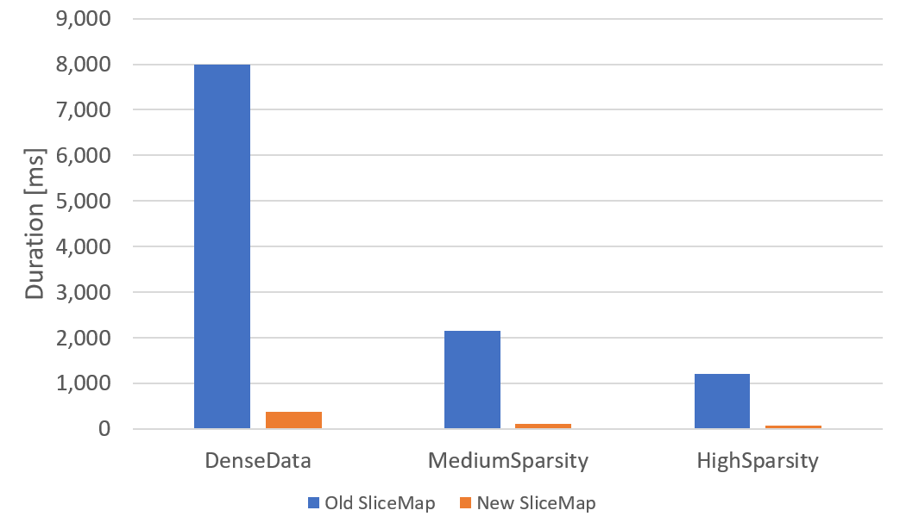

# SliceMap Rework - Part 2


Welcome to part 2 of this series. In the [previous post](/blog/2021/08/slicemap-rework-part-1/) we setup our problem which is to speed up the `SliceMap` family of types for sparse data. We created benchmarks and measured the performance of the current implementation. I gave a brief overview of a new approach I had come up with and showed how it failed miserably.

We were in a depressing place at the end of the last post but hope burns eternal! I have already been researching approaches for this problem on and off for a year, so I didn't expect the problem to be slain in a day. Rather than giving up, I went searching for answers.

## Enter Data-Oriented Design

Recently I have been researching Data-Oriented Design. My first introduction to it was a great [talk by Mike Acton](https://youtu.be/rX0ItVEVjHc) as [CppCon](https://cppcon.org/). I regularly watch talks on other languages and paradigms to grow my understanding of the field and this talk in particular struck a chord. While some may find Mike's delivery a little brusque, I found it refreshing. The talk is littered with great lines, but the following is one of my favorite.

> Reality is not a hack you're forced to deal with to solve your abstract, theoretical problem. Reality is the actual problem.
> 
> Mike Acton

Overall, Data-Oriented Design emphasizes data and its transformation as the key thing to design around. It generally eschews Object Orientation as a means of decomposing problems and instead looks at what data layouts and access patterns allow us to extract the maximum performance. This talk sent me deep down a rabbit hole. Eventually I found my way to Jonathan Blow who has given many great talks online. I decided to pick up the book ["Data-Oriented Design"](https://www.amazon.com/Data-oriented-design-engineering-resources-schedules/dp/1916478700/) by [Richard Fabian](https://twitter.com/raspofabs).

I'm still struggling with how I could use Data-Oriented Design to solve my slicing problem when I came to chapter 6 which discusses Searching. On page 114 of the paperback Richard describes how we can have data structures for looking up data that keep track of the query patterns being used. Once a threshold is met, the data could be re-ordered to better suit how the data is being accessed.

This was the moment of insight for me. "Wait!" I said to myself. "In real world use cases, you are often slicing across 1 dimension of the data many times in a row. Then you may start slicing across another dimension many times in a tight loop. Why not have the SliceMap re-order it's data to be optimal for the types of lookups that are being performed!"

## Idea 3: Reorganizing Internals

I went back to the drawing board and reworked how data was being stored in the `SliceMap` types. The internal fields of the 1 dimensional `SliceMap` remained simple. We give the `SliceMap` a comparer for comparing the keys when performing the Hadamard Product. `keys` is just a chunk of memory that is sorted. `values` is contiguous memory where the position is what determines the key it goes with.

```fsharp
type SliceMap<'k, 'v when 'k : comparison> 
    (comparer: IComparer<'k>, 
     keys: ReadOnlyMemory<'k>, 
     values: ReadOnlyMemory<'v>) =

    let comparer = comparer
    let keys = keys
    let values = values
```

`SliceMap2D` gets a little more interesting. We need to remember that a `SliceMap2D` can be thought of as a table in a database where the primary key is made up of two fields: Key1 and Key2. Here is what some example data could look like.
| Key1 | Key2 | Value |
| --- | --- | --- |
| 1 | "A" | 2.0 |
| 1 | "B" | 8.0 |
| 1 | "C" | 3.0 |
| 2 | "B" | 1.7 |
| 2 | "C" | 1.7 |
| 3 | "A" | 9.4 |
| 3 | "B" | 4.6 |
| ... | ... |

 Since we are trying to optimize the speed of slicing the data, we are willing to do some work up front to organize the data. When we initially create the `SliceMap2D`, we will sort the data by Key1 then Key2. This will allow us to use [Run Length Encoding](https://en.wikipedia.org/wiki/Run-length_encoding) on the outer keys, Key1 in this case. We will store the length of the runs of the outer key in an `IndexRange` type.

```fsharp
[<Struct>]
type IndexRange = {
    Start : int
    Length : int
}
```

We will use two arrays for storing Key1 data. One array for the values of Key1, another for the `IndexRange` that corresponds to the key. We will call these fields `OuterKeyValues` and `OuterKeyRanges` respectively. Key2 and Values will be stored in a `ReadOnlyMemory` of their respective types. Key2 and Values have a 1 to 1 matching based on their location in their containers. We can now define `SliceMap2DInternals` for storing this information.

```fsharp
[<Struct>]
type SliceMap2DInternals<'k1, 'k2, 'v when 'k1 : comparison and 'k2 : comparison> = {
    OuterComparer : IComparer<'k1>
    InnerComparer : IComparer<'k2>
    OuterKeyValues : 'k1[]
    OuterKeyRanges : IndexRange[]
    InnerKeyValues : ReadOnlyMemory<'k2>
    Values : ReadOnlyMemory<'v>
}
```

Now, you may notice that I was talking about Key1 and Key2 but then switched to talking about OuterKey and InnerKey. This is where things may get confusing but trust me, we'll get there! We need `SliceMap2D` to be able to restructure itself in order to provide fast slicing across Key1 or Key2. If Key1 data is stored in the OuterKey fields, then it is much faster to slice along Key1 because all we need to do it find the range of values it applies to and simply just slice the memory for `InnerKeyValues` and `Values` to create a `SliceMap`.

If Key2 is stored in the `InnerKeyValues` field, it is difficult to slice because a particular value of Key2 could occur in multiple places in `InnerKeyValues`. But what if we were able to flip which key was stored in the `OuterKeyValues` and `OuterKeyRanges` fields and which one was stored in `InnerKeyValues`? Well, then we could slice along the Key2 dimension quickly since all its values would be contiguous after flipping.

The "problem" is that F# is statically typed and doesn't like you changing the type of fields. Fortunately, every problem in F# is solved with another type. Enter the `SliceMap2DState`.

```fsharp
type SliceMap2DState<'k1, 'k2, 'v when 'k1 : comparison and 'k2 : comparison> =
    | Key1Key2 of SliceMap2DInternals<'k1, 'k2, 'v>
    | Key2Key1 of SliceMap2DInternals<'k2, 'k1, 'v>
```

What this Discriminated Union is doing is containing the information for how the keys are stored in the `SliceMap2DInternals`. It tells us if Key1 is in the outer fields or if Key2 is. Now we can define `SliceMap2D`.

```fsharp
type SliceMap2D<'k1, 'k2, 'v when 'k1 : comparison and 'k2 : comparison>
    (internalState: SliceMap2DState<_, _, _>) =

    let mutable internalState = internalState
```

Notice, `SliceMap2D` is storing its state in a mutable field so it can change it when it wants. When you go to slice along a dimension, it will check how the data is laid out. If the data is not laid out for efficient slicing, it will swap the keys around. Here is what the slicing method looks like.

```fsharp
    member _.Item
        // Ignoring `f` at this time
        with get (x: 'k1, f: Filter) =

            // Get the internals
            let internals =
                // Check which state the internals are in
                match internalState with
                // This is the ideal state for serving up this slice so do nothing
                | SliceMap2DState.Key1Key2 i -> i
                // If the internals are in this state, we will swap the keys so
                // that slicing can be fast
                | SliceMap2DState.Key2Key1 i -> 
                    let reOrdered = SliceMap2DInternals.swapKeys i
                    internalState <- SliceMap2DState.Key1Key2 reOrdered
                    reOrdered

            let mutable intervalIdx = 0
            let mutable keepSearching = true

            // Perform a scan to find the matching key. We'll come back to this 😉
            while keepSearching && intervalIdx < internals.OuterKeyValues.Length - 1 do
                if internals.OuterComparer.Compare (internals.OuterKeyValues[intervalIdx], x) = 0 then
                    keepSearching <- false
                else
                    intervalIdx <- intervalIdx + 1

            if not keepSearching then
                // The key was found, and we can slice the contiguous data
                let interval = internals.OuterKeyRanges[intervalIdx]
                // We have ensured that the pertinent data is contiguous so we can use
                // slicing to get the necessary data
                let newKeys = internals.InnerKeyValues.Slice (interval.Start, interval.Length)
                let newValues = internals.Values.Slice (interval.Start, interval.Length)
                // Return a SliceMap with the data slice
                SliceMap (internals.InnerComparer, newKeys, newValues)
            else
                // The key was not found, return an empty SliceMap
                SliceMap (internals.InnerComparer, ReadOnlyMemory Array.empty, ReadOnlyMemory Array.empty)

```

The reason this is a valid optimization is that `SliceMap` was never intended as a general-purpose data structure. It was built to make composing Mathematical Planning problems clean and simple. When creating constraints, the dominant usage pattern is to perform the same slice many times for different values. Honestly, I put too much functionality into the original `SliceMap`. I lost focus on what the real problem was. You can see our solution up to this point at this [repo and branch](https://github.com/matthewcrews/SliceMapPerformanceExploration/tree/step04-array-internals).

## Did We Get Faster?

In the previous post we ran our benchmarks against the current implementation, and we got the following timings.

|         Method |    Mean |    Error |   StdDev |
|--------------- |--------:|---------:|---------:|
|      DenseData | 7.993 s | 0.0748 s | 0.0700 s |
| MediumSparsity | 2.154 s | 0.0176 s | 0.0156 s |
|   HighSparsity | 1.209 s | 0.0134 s | 0.0126 s |

These are the timings we get for our new version of `SliceMap2D` with self-adjusting internals.

|         Method |      Mean |    Error |   StdDev |
|--------------- |----------:|---------:|---------:|
|      DenseData | 379.05 ms | 5.281 ms | 4.940 ms |
| MediumSparsity | 113.99 ms | 0.647 ms | 0.574 ms |
|   HighSparsity |  71.89 ms | 0.636 ms | 0.595 ms |

It looks a little better when we plot the performance against each other.



So, it got a little faster 😊. I almost cried when I saw this. The fact that this problem has been tormenting me for over a year problem had something to do with it. We have even more gains on the horizon! There are several other things we can do to speed this up. Feel free to check out this [repo and branch](https://github.com/matthewcrews/SliceMapPerformanceExploration/tree/step04-array-internals) to see what all of the code looks like and run the benchmarks for yourself! I welcome feedback and ideas!

Please send me an email at matthewcrews@gmail.com if you have any questions and subscribe so you can stay on top new posts and products I am offering.



