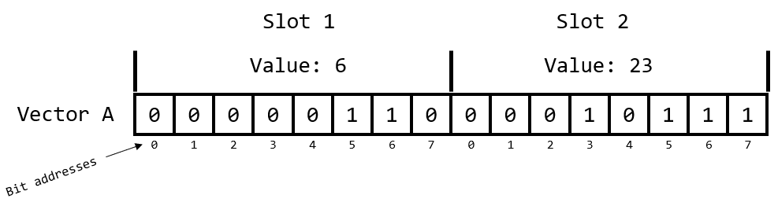
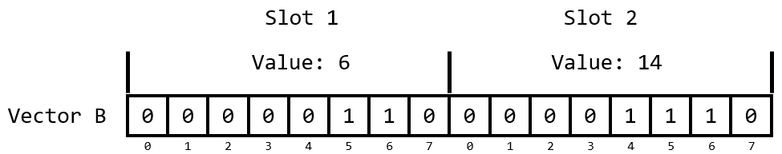
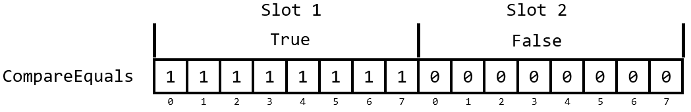
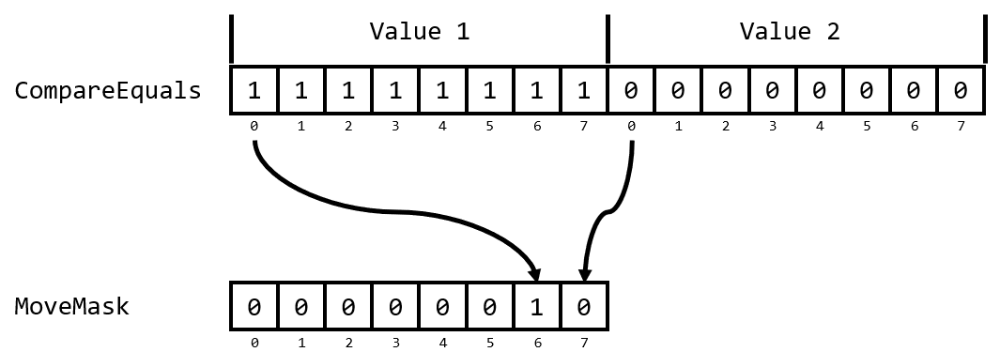

# Accelerating Dictionary Lookup with Records as Keys


> **NOTE**: All the code can be found [here](https://github.com/matthewcrews/RecordsAsKeysForDictionary). Feel free to follow along!

## The Problem

I ran into an interesting problem a week ago and I think others may find some value in it. I am currently working on writing a small Discrete-Event Simulation engine for a manufacturing facility. This problem required a bespoke solution since the current products that are available on the market are built with Modelers in mind and not deployment. In our ideal scenario this engine gets embedded in a decision-making product that is run by a Plant Manager.

The goal is to take a Discrete-Event model of the facility and then wrap it in an optimization loop to find the best possible schedule for the facility. For optimization to be effective, you need to be able to run the model as fast as possible. At each time step we need to evaluate how the processes in the facility are going to respond to the updated state. Let's call this evaluation `CalculateChange`. The input for the `CalculateChange` is a type called `Settings`. `Settings` holds the parameters for the pieces of equipment in the facility. The result of calling `CalculateChange` will be a `Changes` type which holds the changes we will make to the model.

In our case, for a given `Settings` we will always get the same `Changes` back from `CalculateChange`. This means that `CalculateChange` is a natural candidate for [memoization](https://en.wikipedia.org/wiki/Memoization). The easiest way to memoize a function, that I am aware of, is to store results in a `Dictionary` and check to see if a result is already stored in it. A silly example of memoization is the following.

```fsharp
// Create a Dictionary to hold our results
let cache = Dictionary ()

let memoizedFunction (a: int) =

    match cache.TryFindValue a with
    | true, result ->
        // Yay, the result for `a` was in our cache
        result
    | false, _ ->
        // Booooo! The result was not in our cache :/
        // Now we have to call the expensive function
        let result = reallyExpensiveFunctionToCall a
        // We store the result so that it will be in the cache next time
        cache.[a] <- result
        // Now return the result
        result

```

Here we are trying to keep from having to evaluate `reallyExpensiveFunctionToCall` each time by storing the result. Memoization can be a powerful way to speed up your programs. You are trading memory footprint for speed. This means this technique should only be used in an environment where you have plenty of memory available and what you really need is speed.

## The Challenge

This is where things take an interesting turn. Our `Settings` type is made up of a few arrays. Two of them are `array<float>` and one of them is an `array<BufferState>`. `BufferState` is a [Discriminated Union](https://docs.microsoft.com/en-us/dotnet/fsharp/language-reference/discriminated-unions) with 3 cases: `Full`, `Partial`, and `Empty`.

```fsharp
type BufferState =
    | Full
    | Partial
    | Empty

type Settings =
    {
        Levels : array<float>
        MaxRates : array<float>
        Buffers : array<BufferState>
    }
```

I am wanting to use the `Settings` type as a Key in a Dictionary. Now, some of you may already have alarms going off in your head. We are wanting to hash and check equality of something that has `float` in it. If you ask a question about this on StackOverflow, the first responses will typically be people telling you not to do that. I will echo their caution but add some context about when it is okay.

Equality of any floating-point number is a notoriously difficult problem. Floating point math has rounding error built in which means that something that works mathematically may not work computationally. For example. Try putting this into an F# Interactive session and you will get false.

```fsharp
// This will return FALSE
0.1 + 0.2 = 0.3
```

If you were taking a math class, the answer would be true, obviously. Using floating point math though `0.3` cannot be perfectly represented so what you get it when you put in `0.3` is 

```
0.299999999999999988897769753748434595763683319091796875
```

Likewise, when you add `0.1` and `0.2` together you get

```
0.3000000000000000444089209850062616169452667236328125000
```

Those two numbers are very, very close but they are technically not the same. Okay, so I agree with the StackOverflow mob that testing equality of floats is fraught with danger. There are situations where it IS okay though. Those situations are when you are needing to compare `float` values that no math has been performed on. In my use case, the values in `Settings` are parameters that are being set on the condition of other parts of the facility. They are not the result of any computation. This means that I can reliably test their equality because no math has been performed on them.

> **Note**: I highly recommend reading the paper [What Every Computer Scientist Should Know About Floating-Point Arithmetic](https://www.itu.dk/~sestoft/bachelor/IEEE754_article.pdf) by David Goldberg. It's probably way more detail than you need at this time but if you are working with floating-point math it's worth your time.

What is nice is that F# is going to give us structural equality for free. This means using `Settings` as a key for a record should be no problem, right? Well, as with everything the answer is, "It depends...". Earlier this year, Isaac Abraham wrote a [great blog post](https://www.compositional-it.com/news-blog/custom-equality-and-comparison-in-f/) for Compositional IT which went into the performance gains that can be had from writing custom equality and comparison in F#. I highly recommend you go read that article first before continuing.

In that article Isaac showed that there can be significant speed gains from implementing your own equality on a Record. In his tests the speed up for a Dictionary lookup was anywhere from 2 to 3 times faster. That has significant implications on the runtime of your algorithm if there is a Dictionary lookup in the heart of an inner loop. In my use case I want to lookup results in a Dictionary at every single time step of the simulation because a Dictionary lookup is still several orders of magnitude cheaper than running the expensive calculation logic.

Before we go doing anything though, let's establish the baseline of our performance so we don't flail around blindly. For this domain the values of `Levels` field can range from `0.0` to `100.0` and it can contain anywhere from 10 to 100 values. The values in `MaxRates` range from `0.0` to `10.0` and contain anywhere from 10 to 100 values. The values of the `Buffers` field are evenly distributed between the three possible states of `BufferState` and can be from 10 to 100 values. We'll need to generate some data for us to test on.

```fsharp
open System

// Parameters for generating test data
let rng = Random (123)
let maxLevelValue = 100.0
let maxRateValue = 100.0
// How many lookups we will perform in our test
let lookupCount = 10_000

// Maximum length of the arrays
let maxLevelsLength = 100
let maxRatesLength = 100
let maxBufferStateLength = 100

// How many arrays to generate
let levelsCount  = 1_000
let maxRatesCount = 1_000
let buffersCount = 1_000

// How many different random Settings to generate
let randomSettingsCount = 1_000


// Function to create an array<float> with random values
let randomFloatArray (rng: Random) maxValue length =
    let result = Array.zeroCreate length

    for i = 0 to result.Length - 1 do
        result.[i] <- maxValue * (rng.NextDouble ())

    result


// Function to create an array<BufferState> with random values
let randomBufferStateArray (rng: Random) maxValue length =
    let result = Array.zeroCreate length

    for i = 0 to result.Length - 1 do
        // The `Next` method is generating values from 0 to 2
        // The MaxValue arg used here is exclusive
        match rng.Next 3 with
        | 0 -> result.[i] <- BufferState.Empty
        | 1 -> result.[i] <- BufferState.Full
        | 2 -> result.[i] <- BufferState.Partial
        | _ -> failwith "Really?"

    result

// Generate possible array<float> to be used as the Levels field
let levels =
    seq {
        for _ in 1 .. levelsCount ->
            ((rng.Next maxLevelsLength) + 1) // Generate a random length
            |> randomFloatArray rng maxLevelValue
    } |> Array.ofSeq

// Generate possible array<float> to be used as the MaxRates field
let maxRates =
    seq {
        for _ in 1 .. maxRatesCount ->
            ((rng.Next maxRatesLength) + 1) // Generate a random length
            |> randomFloatArray rng maxRateValue
    } |> Array.ofSeq

// Generate possible array<BufferState> to be used as the BufferStates field
let bufferStates =
    seq {
        for _ in 1 .. bufferStatesCount ->
            ((rng.Next maxRatesLength) + 1)
            |> randomBufferStateArray rng
    } |> Array.ofSeq
```

Now we have some random data that we want to sample from to generate our random `Settings` type which we will use for lookup. The way we will do this is by creating a set of indices that we will use to lookup values for `Levels`, `MaxRates`, and `BufferStates`. The reason we want to do this is because we are going to create alternatives to the `Settings` type and we want to be sure those alternatives are populated with the same data. If it doesn't make sense now, it will in a few minutes.

```fsharp
// We want to make sure that all of our versions of the Settings type
// have the same underlying data to hash and compare. This means we
// need to compute the indices for the underlying data and use them
// for all the versions of the Settings type we create.
let valueIndexes =
    seq {
        for _ in 1 .. randomSettingsCount ->
        {|
            LevelsIdx = rng.Next (0, levels.Length)
            MaxRatesIdx = rng.Next (0, maxRates.Length)
            BufferStatesIdx = rng.Next (0, buffers.Length)
        |}
    } |> Array.ofSeq
    
// We now generate the random Settings we will be using
let settings =
    seq {
        for vi in valueIndexes ->
        {
            Levels = levels[vi.LevelsIdx]
            MaxRates = maxRates[vi.MaxRatesIdx]
            Buffers = buffers[vi.BufferStatesIdx]
        }
    } |> Array.ofSeq
```

Now let's generate a set of indices which we will use to select the `Settings` values we will look up in our performance test. Again, we are generating the indices then creating another array which holds the `Settings` values we will look up so that we can use the indices to generate the exact same list when we create alternative `Settings` types.

```fsharp
// These will be the indices for deciding which Settings values we
// will look up in each of the dictionary. We want to ensure we are
// looking up equivalent data in all the tests.
let testIndexes =
    seq {
        for _ in 1 .. lookupCount ->
            rng.Next (0, randomSettingsCount)
    } |> Array.ofSeq

// The values we will test looking up in a Dictionary
let settingsKeys =
    testIndexes
    |> Array.map (fun idx -> settings.[idx])
```

Alright! We have our random `Settings` and we have the lookups we want to test. We'll now put our random `Settings` values into a `Dictionary<Settings, int>` to test looking up values.

```fsharp
// Create the dictionary for looking up Settings
let settingsDictionary =
    settings
    |> Array.mapi (fun i settings -> KeyValuePair (settings, i))
    |> Dictionary
```

We can now create our test. We will be using [benchmarkDotNet](https://github.com/dotnet/BenchmarkDotNet) for our performance testing. BenchmarkDotNet has us create a class and annotate methods with the `[<Benchmark>]` attribute so that the performance analyzer knows what code to test. Let's open the necessary namespaces and write a test for our default `Settings` type.

```fsharp
open BenchmarkDotNet.Attributes
open BenchmarkDotNet.Running

// Type to contain our performance tests
type Benchmarks () =

    [<Benchmark>]
    member _.Default () =
        let mutable idx = 0
        let mutable result = 0

        while idx < settingsKeys.Length do
            let testKey = settingsKeys[idx]
            result <- settingsDictionary[testKey]

            idx <- idx + 1

        result
```

We then build our project by opening a terminal in the directory that holds our `.fsproj` file and build the project with the `Release` configuration.

```terminal
dotnet build -c Release
```

This will create a release build of our code in the directory `<Project Root>/bin/Release/net6.0`. I open a terminal in this directory and run the `.exe` that was generated and get the following table as the result.

|  Method |     Mean |    Error |   StdDev |
|-------- |---------:|---------:|---------:|
| Default | 36.73 ms | 0.472 ms | 0.442 ms |

This means that it is taking us 36.73 ms on average to look up our `Settings` type in the Dictionary 1,000 times. We now have a performance baseline.

## Simple Override

Let's do the next, obvious thing and try defining a new version of `Settings` in a new module called `Simple` where we will use the easiest means of overriding the default equality behavior. I am going to put this new type and its data in a separate module to isolate it to prevent type collision headaches.

```fsharp
module Simple =

    [<CustomEquality; NoComparison>]
    type Settings =
        {
            Levels : array<float>
            MaxRates : array<float>
            Buffers : array<BufferState>
        }
        override this.Equals b =
            match b with
            | :? Settings as other ->
                this.Levels = other.Levels
                && this.MaxRates = other.MaxRates
                && this.Buffers = other.Buffers
            | _ -> false
            
        override this.GetHashCode () =
            hash (this.Levels, this.MaxRates, this.Buffers)
```

Nothing exotic going on here. We've added the attributes `[<CustomEquality>]` and `[<NoComparison>]`. `[<CustomEquality>]` is telling the F# compiler that we are going to provide our own overloads for `Equals` and `GetHashCode`. We have to also add `[<NoComparison>]` because the compiler wants us to also define the necessary methods for performing comparisons. We aren't testing that right now, so we are telling the compiler, "I don't want to define comparison so just don't allow me to compare it." This is one of the downsides of overriding default behavior. Now that we've told the compiler we are defining equality, we have taken on more responsibility for how this type behaves.

Let's generate the necessary test data and update our `Benchmark` class with a new testing method. I just copy and paste the code that we used for the default `Settings` type into the module where we defined our new `Settings` with overrides.

```fsharp
module Simple =

    // Type definition here...

    // This is why we defined that array of indices before. So we could generate new Settings types
    // that were populated with the same data.
    // We now generate the random Settings which uses our custom overrides
    let settings =
        seq {
            for vi in valueIndexes ->
            {
                Levels = levels[vi.LevelsIdx]
                MaxRates = maxRates[vi.MaxRatesIdx]
                Buffers = buffers[vi.BufferStatesIdx]
            } // Making sure we are getting the type we want
        } |> Array.ofSeq
    
    // The values we will test looking up in a Dictionary
    let settings =
        testIndexes
        |> Array.map (fun idx -> settings[idx])
        
    // Create the dictionary for looking up Settings
    let settingsDictionary =
        settings
        |> Array.mapi (fun i settings -> KeyValuePair (settings, i))
        |> Dictionary
```

And now we add our test to the `Benchmarks` class. We also moved the default `Settings` into a module of its own so now we need to prefix the initial test with `Default`.  Our `Benchmark` class will now look like this.

```fsharp
// Type to contain our performance tests
type Benchmarks () =

    [<Benchmark>]
    member _.Default () =
        let mutable idx = 0
        let mutable result = 0

        while idx < Default.settingsKeys.Length do
            let testKey = Default.settingsKeys[idx]
            result <- Default.settingsDictionary[testKey]

            idx <- idx + 1

        result
        
    [<Benchmark>]
    member _.Simple () =
        let mutable idx = 0
        let mutable result = 0

        while idx < Simple.settingsKeys.Length do
            let testKey = Simple.settingsKeys[idx]
            result <- Simple.settingsDictionary[testKey]

            idx <- idx + 1

        result
```

We do another build and re-run our benchmarks. Upon completion we get these results.

|  Method |     Mean |    Error |   StdDev |
|-------- |---------:|---------:|---------:|
| Default | 37.69 ms | 0.428 ms | 0.357 ms |
|  Simple | 37.82 ms | 0.271 ms | 0.241 ms |

This is wildly disappointing. This had no affect which honestly, is probably a good thing. What we just implemented is essentially the default behavior of F# so we shouldn't expect a big change. At this point though, I got curious as to how exactly is F# generating hash codes for `array<float>`. I went digging into the F# source and found my way to the [prim-types.fs](https://github.com/dotnet/fsharp/blob/main/src/fsharp/FSharp.Core/prim-types.fs) file. One thing I notice in my sleuthing is that F# has some specialized functions for generating hashcodes for `array<int>`, `array<int64>`, and `array<byte>` but I didn't see any for `array<float>`. Hmm, what if we created one and used that for generating our hashcodes?

## HashCode for `array<float>`

I decided to ~~steal~~ borrow the function that F# is using for combining hashcodes found [here](https://github.com/dotnet/fsharp/blob/dc81e22205550f0cedf4295b06c3a1e338c1cfa1/src/fsharp/FSharp.Core/prim-types.fs#L1625). I also copy and paste the specialized function for hashing `array<int>` found [here](https://github.com/dotnet/fsharp/blob/dc81e22205550f0cedf4295b06c3a1e338c1cfa1/src/fsharp/FSharp.Core/prim-types.fs#L1650) and change it up a little to work with `array<float>`. I put this new functions into a new module `FloatHash`.

```fsharp
module FloatHash =

    // Source: https://github.com/dotnet/fsharp/blob/dc81e22205550f0cedf4295b06c3a1e338c1cfa1/src/fsharp/FSharp.Core/prim-types.fs#L1625
    let inline HashCombine nr x y = (x <<< 1) + y + 631 * nr

    let HashFloatArray (x: array<float>) : int =
            let len = x.Length
            let mutable i = len - 1 
            let mutable acc = 0
            while (i >= 0) do 
                acc <- HashCombine i acc (int x.[i])
                i <- i - 1
            acc
```

Now we have the ingredients to make our own hashing function for our `Settings` type. Let's define a new `Settings` using this new functionality.

```fsharp
module FloatHash =
          
    // ...new functions here

    [<CustomEquality; NoComparison>]
    type Settings =
        {
            Levels : array<float>
            MaxRates : array<float>
            Buffers : array<BufferState>
        }
        override this.Equals b =
            match b with
            | :? Settings as other ->
                this.Levels = other.Levels
                && this.MaxRates = other.MaxRates
                && this.Buffers = other.Buffers
            | _ -> false
            
        override this.GetHashCode () =
            // We now use our `hashFloatArray` 
            let levelsHash = HashFloatArray this.Levels
            let maxRatesHash = HashFloatArray this.MaxRates
            let buffersHash = this.Buffers.GetHashCode()
            hash (levelsHash, maxRatesHash, buffersHash)
```

We again copy and paste the data generating code into this new module to create our test data with our new type. We then add a third method to our `Benchmarks` class to test this new approach.

```fsharp
type Benchmarks () =

    // Previous benchmarks are still here. I'm just not posting the code for brevity

    [<Benchmark>]
    member _.FloatHash () =
        let mutable idx = 0
        let mutable result = 0

        while idx < FloatHash.settingsKeys.Length do
            let testKey = FloatHash.settingsKeys[idx]
            result <- FloatHash.settingsDictionary[testKey]

            idx <- idx + 1

        result
```

After we compile and run our benchmarks, we get the following.

|    Method |     Mean |    Error |   StdDev |
|---------- |---------:|---------:|---------:|
|   Default | 37.12 ms | 0.648 ms | 0.606 ms |
|    Simple | 36.84 ms | 0.270 ms | 0.253 ms |
| FloatHash | 10.12 ms | 0.093 ms | 0.087 ms |

Whoa! Now that's interesting. We get a significant speed up when using a function that is specifically made for a `array<float`>. Now we are making progress.

## Faster by Ignoring

Now, if you are one of the few people who clicked the links to the F# source code, you may notice that the version of `HashFloatArray` I wrote isn't quite like the version that is in the F# source code. The F# source code only hashes up to the first 18 values. It ignores the elements after that. I'm assuming the rationale is that the first 18 elements are sufficient for generating a unique enough hashcode. Let's create a new module `FloatHashSort` where we define a new `Settings` type that uses this abbreviated hashing.

```fsharp
module FloatHashShort =
    
    // To limit the number of elements we use for hashing
    let defaultHashNodes = 18
    let inline HashCombine nr x y = (x <<< 1) + y + 631 * nr
    
    let HashFloatArray (x: array<float>) : int =
          let len = x.Length
          let mutable i = len - 1
          if i > defaultHashNodes then i <- defaultHashNodes // limit the hash
          let mutable acc = 0
          while (i >= 0) do 
              acc <- HashCombine i acc (int x.[i])
              i <- i - 1
          acc
          
    [<CustomEquality; NoComparison>]
    type Settings =
        {
            Levels : array<float>
            MaxRates : array<float>
            Buffers : array<BufferState>
        }
        override this.Equals b =
            match b with
            | :? Settings as other ->
                this.Levels = other.Levels
                && this.MaxRates = other.MaxRates
                && this.Buffers = other.Buffers
            | _ -> false
            
        override this.GetHashCode () =
            let levelsHash = HashFloatArray this.Levels
            let maxRatesHash = HashFloatArray this.MaxRates
            let buffersHash = this.Buffers.GetHashCode()
            hash (levelsHash, maxRatesHash, buffersHash)

    // There is also the data creation code here but I'm leaving it out because it's a repeat of
    // what you have seen already.
```

And we add a fourth benchmark to `Benchmarks`.

```fsharp
type Benchmarks () =

    // ...previous benchmarks here

    [<Benchmark>]
    member _.FloatHashShort () =
        let mutable idx = 0
        let mutable result = 0

        while idx < FloatHashShort.settingsKeys.Length do
            let testKey = FloatHashShort.settingsKeys[idx]
            result <- FloatHashShort.settingsDictionary[testKey]

            idx <- idx + 1

        result
```

We recompile and run those benchmarks! Let's see what we get.

|         Method |      Mean |     Error |    StdDev |
|--------------- |----------:|----------:|----------:|
|        Default | 35.546 ms | 0.5105 ms | 0.3985 ms |
|         Simple | 38.245 ms | 0.3848 ms | 0.3600 ms |
|      FloatHash |  9.861 ms | 0.0399 ms | 0.0333 ms |
| FloatHashShort |  9.459 ms | 0.0965 ms | 0.0903 ms |

Alright! A little more progress. Nothing crazy but we'll take everything we can get.

## Faster `array<float>` Equality

We made a little progress now on the `GetHashCode` side of our problem. Let's look at the Equals now. We would like to speed this up. Right now, we are using the built in functionality of F# to evaluate the equality of the arrays. Let's write our own to see if we get more performance.

We are going to write a function which is going to take two `array<float>` and test whether all the values are the same. We will be using a `while` loop in this case. From my understanding, all loops get compiled down to `while` loops in IL. Using a `while` will get early termination and the most compact assembly that I am aware of. For more info on optimizing .NET I refer you to Federico Andres Lois (@federicolois) and Bartosz Adamczewski (@badamczewski01). We create a new module, `FloatArrayEquals`, to hold our new approach.

```fsharp
module FloatArrayEquals =

    // ...our updated hashing code is still here. Not shown for brevity

    // The function we will use to compare the values in two float arrays
    let FloatArrayEquals (a: array<float>) (b: array<float>) =
        if a.Length <> b.Length then
            invalidArg (nameof b) "Cannot check equality on arrays of different lengths"
            
        let mutable idx = 0
        let mutable result = true
        
        // Use a while loop to create better assembly
        while idx < a.Length && result do
            if a.[idx] <> b.[idx] then
                result <- false
                
            idx <- idx + 1
            
        result

    [<CustomEquality; NoComparison>]
    type Settings =
        {
            Levels : array<float>
            MaxRates : array<float>
            Buffers : array<BufferState>
        }
        override this.Equals b =
            match b with
            | :? Settings as other ->
                // We are using our new function to compare the values
                // in our array<float>
                (FloatArrayEquals this.Levels other.Levels)
                && (FloatArrayEquals this.MaxRates other.MaxRates)
                && this.Buffers = other.Buffers
            | _ -> false
            
        override this.GetHashCode () =
            let levelsHash = HashFloatArray this.Levels
            let maxRatesHash = HashFloatArray this.MaxRates
            let buffersHash = this.Buffers.GetHashCode()
            hash (levelsHash, maxRatesHash, buffersHash)
```

We add a new method to `Benchmark`...

```fsharp
type Benchmarks () =
    // Previous benchmarks are still here...
        
    [<Benchmark>]
    member _.ArrayEquals () =
        let mutable idx = 0
        let mutable result = 0

        while idx < ArrayEquals.settingsKeys.Length do
            let testKey = ArrayEquals.settingsKeys[idx]
            result <- ArrayEquals.settingsDictionary[testKey]

            idx <- idx + 1

        result
```

Then compile and run our tests to get...

|         Method |      Mean |     Error |    StdDev |
|--------------- |----------:|----------:|----------:|
|        Default | 37.085 ms | 0.1836 ms | 0.1627 ms |
|         Simple | 35.839 ms | 0.2870 ms | 0.2544 ms |
|      FloatHash | 10.189 ms | 0.1942 ms | 0.1907 ms |
| FloatHashShort |  9.454 ms | 0.1645 ms | 0.1539 ms |
|    ArrayEquals |  7.100 ms | 0.1289 ms | 0.1324 ms |

This is great! We are still making progress. Before F# had to figure out what method to call in order to evaluate equality. Here we can skip that and use a loop tuned for this exact problem.

## Enter the SIMD

Now, I skipped something at the very beginning of this whole post. There was a version of my simulation code where the `Settings` type did not contain arrays. It was a more complex set of types. I've been on a journey to learn how to write faster code because speed is a huge differentiator in my field. I work in a .NET shop, but we still want to have fast simulations. During my wanderings I have found [Data-Oriented Design](https://en.wikipedia.org/wiki/Data-oriented_design) and [Entity Component Systems](https://en.wikipedia.org/wiki/Entity_component_system). These are broad topics, but they are really about arranging your data to achieve high performance.

I have been building code with a more Entity Component style. I'm not building full Entity Component systems but I'm tending toward Structs of Arrays (SoA) instead of Arrays of Structs (AoS) as a way to organize data ([AoS vs SoA](https://en.wikipedia.org/wiki/AoS_and_SoA)). `Settings` is a type that has gone through that transformation. By arranging data in a way that is sympathetic to how computers work, we can achieve much better performance.

One of the tools that becomes available to you when you arrange your data in nice contiguous blocks of data is [SIMD instructions](https://en.wikipedia.org/wiki/SIMD). Practically all modern processors have special instructions which operate on multiple pieces of data simultaneously. This is exactly what we are doing with the equality checks in our `Equals` methods. For our first step into SIMD, let's use some [SSE2](https://en.wikipedia.org/wiki/SSE2) instructions to test the equality of `array<float>`. SSE2 allows us to operate on 128 bits at a time. This means we can test the equality of 2 `float` at the same time.

> **Note**: The Intrinsics libraries are designed as zero safeties type of library. It is incumbent on the developer to check whether the CPU actually has the required intrinsics available. Most modern x86 CPUs will have everything that I am showing. Best practice is to have code check as to whether the instructions are available and providing a fallback function if they are not. A fallback for us would simply be the code earlier in this post. Production code should contain checks and fallbacks. You have been warned.

I am going to show you the function we will use for stepping through two arrays simultaneously and then break it down for you line by line. In this case I think it's easier for you to see the whole picture first and then have me explain what is happening to you.

```fsharp
module SseFloatArrayEquals =

    // Open some new namespace we will need
    open FSharp.NativeInterop
    open System.Runtime.Intrinsics.X86
    open System.Runtime.Intrinsics

    // Note, we are still using the same hashing functions. There just not shown for brevity

    // This is the new function we will use for comparing values
    let equals (a: array<float>) (b: array<float>) =
        if a.Length <> b.Length then
            invalidArg (nameof b) "Cannot check equality on arrays of different lengths"
        
        let mutable result = true
        let mutable idx = 0
        let lastBlockIdx = a.Length - (a.Length % Vector128<float>.Count)
        use aPointer = fixed a
        use bPointer = fixed b

        while idx < lastBlockIdx && result do
            let aVector = Sse2.LoadVector128 (NativePtr.add aPointer idx)
            let bVector = Sse2.LoadVector128 (NativePtr.add bPointer idx)
            let comparison = Sse2.CompareEqual (aVector, bVector)
            let mask = Sse2.MoveMask comparison
            result <- (mask = 3)

            idx <- idx + Vector128<float>.Count

        while idx < a.Length && result do
            if a.[idx] <> b.[idx] then
                result <- false

            idx <- idx + 1

        result
```

Okay, let's unpack what is happening in `equals`. In the first couple of lines, I'm making sure that the two arrays are the same length.

```fsharp
if a.Length <> b.Length then
    invalidArg (nameof b) "Cannot check equality on arrays of different lengths"
```

Next I create some values I will be using to track my progress through the loop.

```fsharp
let mutable result = true
let mutable idx = 0
```

I then need to calculate the last index at which I can use the SIMD instructions. Past this index I will need to fall back to scalar operations since I don't have a big enough chunk of data to work on.


```fsharp
let lastBlockIdx = a.Length - (a.Length % Vector128<float>.Count)
```

We now need to get a pointer to the arrays. The [`fixed`](https://docs.microsoft.com/en-us/dotnet/fsharp/language-reference/fixed) keyword is used to pin down the array and give us a pointer. We don't want the garbage collector moving data around while our function is running. This is what we use to tell the runtime to leave it alone until we are done with it. Instead of using `let` to bind the result, we use the [`use`](https://docs.microsoft.com/en-us/dotnet/fsharp/language-reference/resource-management-the-use-keyword) keyword. `use` tells the compiler that the resource should be collected once the value has gone out of scope. This is important since we don't want memory to stay pinned forever.

```fsharp
use aPointer = fixed a
use bPointer = fixed b
```


Now let's look at the loop where we are actually doing the work. The calls to `Sse2.LoadVector128` are loading the data into the registers to be worked on in parallel. `Sse2.CompareEqual` tells the CPU to compare the values in `aVector` and `bVector` for equality. If the values are equal, then it will set the result to 1 values. If they are not, they are set to 0.

```fsharp
let aVector = Sse2.LoadVector128 (NativePtr.add aPointer idx)
let bVector = Sse2.LoadVector128 (NativePtr.add bPointer idx)
let comparison = Sse2.CompareEqual (aVector, bVector)
```

Here's what this operation would look like if we were working in 8-bit. I'm using 8-bit because I didn't want to have to draw out 32 boxes for 32-bit but the concepts translate to whatever bit-ness you are using. Here is what the data looks like if Vector A had the values 6 and 23 loaded in.



And let's say we had the values 6 and 14 loaded into Vector B.



When we perform the `Sse1.CompareEqual` method on these two vectors we will get 1's where the slots match, and 0's where they did not. Notice I said SLOT, not bit. You should think of it as the entire slot matching, not necessarily a number because this can be done with many different data types which have different widths.



Now we need to check the result of the comparison. We do that by calling `Sse2.MoveMask`.

```fsharp
let mask = Sse2.MoveMask comparison
result <- (mask = 3)
```

`MoveMask` is calling a `MOVMSK` hardware intrinsic which is kind of a magical operation that confused me to no end. The explanation of it in the Intel documentation didn't help me much either. There are actually a lot of different `MOVMSK` intrinsics depending on the data you are working with. In our case it is working with a 64-bit float so it is calling [`MOVMSKPD`](https://www.laruence.com/x86/MOVMSKPD.html). All `MOVMSK` operations take the highest order bit from each slot and put them in the lowest order bits in the output. This is effectively creating a [Bitmask](https://en.wikipedia.org/wiki/Mask_(computing)). A Bitmask can also be interpreted as an `int`.

Here is an example of what `MOVMSK` is doing using my 8-bit example.



It moved the highest order bit from each slot into the lowest order bits on the output. This new mask gets interpreted as an `int` which has a value of `2`.

So, in this code, if both values match the output mask would have `11` in the lowest order bits of a 32-bit `int` which would be equivalent to `3`. That's why the test for whether all the values match is `mask = 3`.

Okay, we made it to the bottom of the loop. Now we just need to increment our index forward far enough to get a fresh set of values to load into our vectors. We want to increment by how many of our test elements fit into a `Vector128` which is why we add `Vector128<float>.Count` to the index.

```fsharp
idx <- idx + Vector128<float>.Count
```

We will keep looping until we get through the elements, we can process using the vector operations. We then make it to the final loop which checks any remaining values that we need to process in a scalar way.

```fsharp
while idx < a.Length && result do
    if a.[idx] <> b.[idx] then
        result <- false

    idx <- idx + 1
```

Wow, that was a lot. Let's now create a `Settings` type that uses these SSE2 instructions and see if we get a speed up.

```fsharp
module SseFloatArrayEquals =

    [<CustomEquality; NoComparison>]
    type Settings =
        {
            Levels : array<float>
            MaxRates : array<float>
            Buffers : array<BufferState>
        }
        override this.Equals b =
            match b with
            | :? Settings as other ->
                (equals this.Levels other.Levels)
                && (equals this.MaxRates other.MaxRates)
                && (equals this.Buffers other.Buffers)
            | _ -> false
            
        override this.GetHashCode () =
            let levelsHash = HashFloatArray this.Levels
            let maxRatesHash = HashFloatArray this.MaxRates
            let buffersHash = this.Buffers.GetHashCode()
            hash (levelsHash, maxRatesHash, buffersHash)
```

We then add our new benchmark...

```fsharp
type Benchmarks () =
    // Previous benchmarks still here
    
    [<Benchmark>]
    member _.SseFloatArrayEquals () =
        let mutable idx = 0
        let mutable result = 0

        while idx < SseFloatArrayEquals.settingsKeys.Length do
            let testKey = SseFloatArrayEquals.settingsKeys[idx]
            result <- SseFloatArrayEquals.settingsDictionary[testKey]

            idx <- idx + 1

        result
```

...and compile and run. What do we get?

|              Method |      Mean |     Error |    StdDev |    Median |
|-------------------- |----------:|----------:|----------:|----------:|
|             Default | 39.472 ms | 0.4295 ms | 0.4018 ms | 39.438 ms |
|              Simple | 39.010 ms | 0.5248 ms | 0.4909 ms | 39.157 ms |
|           FloatHash | 10.989 ms | 0.1300 ms | 0.1216 ms | 11.033 ms |
|      FloatHashShort |  9.554 ms | 0.1898 ms | 0.2400 ms |  9.410 ms |
|         ArrayEquals |  7.286 ms | 0.0442 ms | 0.0392 ms |  7.274 ms |
| SseFloatArrayEquals |  6.453 ms | 0.0864 ms | 0.0808 ms |  6.440 ms |

Excellent. A little more progress but we'd still like to see if we can get some more.

## Bytes all the way down

There is a comparison that we haven't looked at yet. It's the equality of the `Buffers` field. You may remember that this field is an `array<BufferState>`. `BufferState` is a discriminated union and so far has been using the built in F# equality. Something important to note, the default DU is a reference type. This means that it is passed by reference and if you want to compare the equality of two different DUs, you'll need to follow there references to get the underlying data.

Fortunately, F# has added the ability to make struct DUs with the `[<Struct>]` keyword. This is great for high performance scenarios but there are downsides. I don't have the space to go into it here but will refer you to Bartosz Sypytkowski's excellent blog post [here](https://bartoszsypytkowski.com/writing-high-performance-f-code/). It's a great read and will provide you significant insight into how to get the most performance out of F#.

So why do I care about the fact that I can make the `BufferState` DU into a struct? Well, if I'm storing all the data in an array and that data is a struct, then everything I need to compare will be contiguous. Now of course there are no hardware intrinsics in an x86 CPU for comparing F# types, but there are intrinsics for comparing raw bytes. If I can get a pointer to the `array<BufferState>` and simply compare the bytes for equality I can accelerate the equality check of the `Buffers` field as well.

Let's get to work. We'll need to define a new type `BufferStateStruct` which is exactly the same as a `BufferState` but with the `[<Struct>]` attribute. We'll put all this new code in a module called `SseByteArrayEquals`.

```fsharp
module SseByteArrayEquals =

    [<Struct>]
    type BufferStateStruct =
        | Full
        | Partial
        | Empty
```

Now we need to define a new `equals` function that can take two `array<'T>` and check their equality based on the bytes matching. Again, I'm going to throw the whole function at you and then break it down. It's like what we went through in the previous section with some minor tweaks.

```fsharp
module SseByteArrayEquals =

    let private equals<'T when 'T : unmanaged> (a: array<'T>) (b: array<'T>) =
        if a.Length <> b.Length then
            invalidArg (nameof b) "Cannot perform equals on arrays of different lengths"
        
        let len = a.Length * sizeof<'T> / sizeof<byte>
        let mutable result = true
        let mutable idx = 0
        let lastBlockIdx = len - (len % Vector128<byte>.Count)
        use pointerA = fixed a
        use pointerB = fixed b
        let bytePointerA = pointerA |> NativePtr.toNativeInt |> NativePtr.ofNativeInt<byte>
        let bytePointerB = pointerB |> NativePtr.toNativeInt |> NativePtr.ofNativeInt<byte>

        while idx <lastBlockIdx && result do
            let aVector = Sse2.LoadVector128 (NativePtr.add bytePointerA idx)
            let bVector = Sse2.LoadVector128 (NativePtr.add bytePointerB idx)

            let comparison = Sse2.CompareEqual (aVector, bVector)
            let mask = Sse2.MoveMask (comparison)

            result <- (mask = 65535)
            idx <- idx + Vector128<byte>.Count

        while idx < len && result do
            result <- ((NativePtr.get bytePointerA idx) = (NativePtr.get bytePointerB idx))
            idx <- idx + 1

        result
```

Our function declarations have changed slightly. We now take an `array<'T>` but we added the restriction `unmanaged`. You can read more about type restrictions [here](https://docs.microsoft.com/en-us/dotnet/fsharp/language-reference/generics/constraints) but this restriction is necessary for us to be able to view the array as just a set of bytes.

At the beginning we have the same check to ensure that the arrays are the same length.

```fsharp
if a.Length <> b.Length then
    invalidArg (nameof b) "Cannot perform equals on arrays of different lengths"
```

We then need to know how long our arrays are in terms of the number of bytes since we will be operating on them as just bytes.

```fsharp
let len = a.Length * sizeof<'T> / sizeof<byte>
```

We then create `result` to track what we have found, create an `int` to track our progress and calculate the index of the last block we will be able to process using vector operations.

```fsharp
let mutable result = true
let mutable idx = 0
let lastBlockIdx = len - (len % Vector128<byte>.Count)
```

We now get our pointers to pin the array down to prevent GC from moving things from underneath us.

```fsharp
use pointerA = fixed a
use pointerB = fixed b
```

What you can't see here is that `pointerA` and `pointerB` are both of type `nativeptr<'T>`. That's not what we want. We want a `nativeptr<byte>`. We use the functions in the `FSharp.NativeInterop` namespace to convert the pointer to a `nativeptr<byte>`.

```fsharp
let bytePointerA = pointerA |> NativePtr.toNativeInt |> NativePtr.ofNativeInt<byte>
let bytePointerB = pointerB |> NativePtr.toNativeInt |> NativePtr.ofNativeInt<byte>
```

The while loop for the vector operations is the same except for one difference. The mask value we check. Before we were comparing 2 floats at a time, so the possible mask values were `00`, `01`, `10`, and `11`. Now we are working in units of `byte` and we operate on 128 bits at a time. This means that when we call `MoveMask` we will generate a mask with potentially 16 1s in the least significant bits. If I type that out as bits it looks like this.

```
00000000 00000000 11111111 11111111
```

That mask is getting interpreted as a 32-bit number which gives a value of `65535`.

```fsharp
while idx < lastBlockIdx && result do
    let aVector = Sse2.LoadVector128 (NativePtr.add bytePointerA idx)
    let bVector = Sse2.LoadVector128 (NativePtr.add bytePointerB idx)

    let comparison = Sse2.CompareEqual (aVector, bVector)
    let mask = Sse2.MoveMask (comparison)

    result <- (mask = 65535) // This has changed since we are working in bytes.
    idx <- idx + Vector128<byte>.Count
```

The rest of the code in the function is the same as before so I won't go over it. Our `Settings` type can change though since our `array<float>` and `array<BufferStateStruct>` can both use this new `equals` function.

```fsharp
    [<CustomEquality; NoComparison>]
    type Settings =
        {
            Levels : array<float>
            MaxRates : array<float>
            Buffers : array<BufferStateStruct>
        }
        override this.Equals b =
            match b with
            | :? Settings as other ->
                // Notice that all of the arrays are using the same equals function
                (equals this.Levels other.Levels)
                && (equals this.MaxRates other.MaxRates)
                && (equals this.Buffers other.Buffers)
            | _ -> false
            
        override this.GetHashCode () =
            let levelsHash = HashFloatArray this.Levels
            let maxRatesHash = HashFloatArray this.MaxRates
            let buffersHash = this.Buffers.GetHashCode()
            hash (levelsHash, maxRatesHash, buffersHash)
```

We add another benchmark...

```fsharp
type Benchmarks () =

    // ...previous benchmarks

    [<Benchmark>]
    member _.SseByteArrayEquals () =
        let mutable idx = 0
        let mutable result = 0

        while idx < SseByteArrayEquals.settingsKeys.Length do
            let testKey = SseByteArrayEquals.settingsKeys[idx]
            result <- SseByteArrayEquals.settingsDictionary[testKey]

            idx <- idx + 1

        result

```

...compile and run our tests to get the following.


|              Method |      Mean |     Error |    StdDev |
|-------------------- |----------:|----------:|----------:|
|             Default | 38.424 ms | 0.4668 ms | 0.4138 ms |
|              Simple | 39.739 ms | 0.4141 ms | 0.3874 ms |
|           FloatHash | 10.290 ms | 0.0969 ms | 0.0859 ms |
|      FloatHashShort |  9.541 ms | 0.1061 ms | 0.0993 ms |
|         ArrayEquals |  7.469 ms | 0.0763 ms | 0.0713 ms |
| SseFloatArrayEquals |  6.966 ms | 0.0580 ms | 0.0453 ms |
|  SseByteArrayEquals |  1.653 ms | 0.0178 ms | 0.0149 ms |

This is great! We got another huge speed boost. Putting your data into vectors and using SIMD to rapidly process them can lead to some huge performance gains.

## Wrap Up

I hope you enjoyed this journey. I had a lot of fun figuring out just how fast I could make this lookup since it is at the heart of some of the most performance sensitive code I wrote. I still have a lot to learn and if you have feedback, I would love to hear it! You can check out the code [here](https://github.com/matthewcrews/RecordsAsKeysForDictionary). You can run the benchmarks yourself and see what you find.

Please send me an email at matthewcrews@gmail.com if you have any questions and subscribe so you can stay on top new posts and products I am offering.



