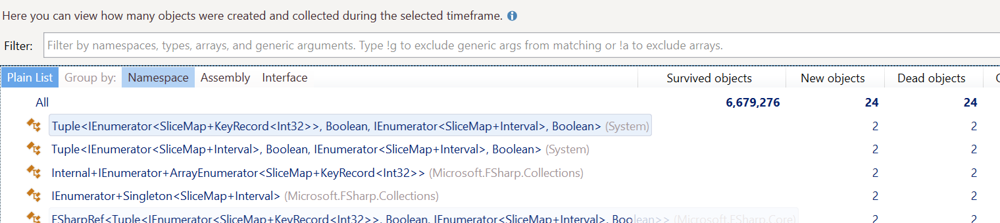

I have been on a journey to overhaul the underpinnings of the [Flips](https://flipslibrary.com/#/) library and it has been a humbling experience. Part of what I believe provides a unique value add compared to other libraries for Mathematical Planning is the `SliceMap` types. They provide a convenient method for subsetting your data that is intuitive for someone who writes optimization models. The `SliceMap` types are heavily influenced by the `TupleDict` type in the [Gurobi library](https://www.gurobi.com/documentation/9.1/refman/py_tupledict.html) for Python.

The major problem with `SliceMap` is that it does not scale well to sparse data sets. I knew this would be the case when I wrote it originally, but the performance was good enough at the time, so I decided to ship. Since then, this performance degradation has been a splinter in my mind that I simply could not shake. There had to be a way to do this well, I just didn't know it yet.

I have spent a year on and off searching for answers. I now have a shelf in my office that is full of books on algorithms, data structures, and multi-dimensional data structures. It's all the best resources I could find that could possibly help me with this problem. While it was fun reading them, it ultimately didn't help much. All these fancy data structures didn't support what appeared to be a unique use case.

This series of posts is going to be me taking you through the journey to where I had the breakthrough and then kept on pushing. I have kept a repo set aside with branches which illustrate each of the milestones so you can see the impact. It includes code for easy benchmarking with [benchmarkDotNet](https://github.com/dotnet/BenchmarkDotNet) and code that you can profile yourself if you wish.

My goal is for you to see the mistakes and understand why some approaches are inefficient, even if the [Big O notation](https://en.wikipedia.org/wiki/Big_O_notation) says they should be faster. Also, I am not a "Pro" performance person. I'm actively learning to diagnose and address performance issues so if you see that I missed something, please let me know! Let's start our journey with understanding the domain we are working in and what the requirements of `SliceMap` are.

## The Linear Programming Domain

`SliceMap` is a set of types specifically for working in the [Linear Programming](https://en.wikipedia.org/wiki/Linear_programming) and [Mixed-Integer Programming](https://en.wikipedia.org/wiki/Linear_programming) domains. I often refer to these domains as "Mathematical Planning" because they are primarily concerned with using mathematics to find the best possible plans. The word "Program" used to mean "Plan" but now the word "Program" has become overloaded since the advent of Computer Science, so I don't like to use it anymore. The academic literature still calls it "Linear Programming" and "Mixed-Integer Programming" though so if you go searching for more resources, you'll need to use the original terms.

The foundation of the LP and MIP domains is the humble Linear Expression. The term "Linear" in mathematics carries a special meaning that I won't go into here. The key thing you need to know is that these expressions are straight. They are not curved in any way. Here are some examples of Linear Expressions:

$$1.0 + x_{1} + 2 \times x_{2}$$
$$3.5 \times x_{1} + 5.7 \times x_{2}$$
$$3.5 \times x_{1} + 14.0$$

The most important thing to note is that you never see two $x$ multiplied together and there is no division. Here the $x$ values correspond to Decisions that we want to evaluate using Mathematical Planning. We can model this small domain using a simple set of types in F#.

```fsharp
type DecisionType =
    | Boolean
    | Integer of LowerBound:float * UpperBound:float
    | Continuous of LowerBound:float * UpperBound:float

type DecisionName = DecisionName of string

type Decision = {
    Name : DecisionName
    Type : DecisionType
}

type LinearExpr =
    | Float of float
    | Decision of Decision
    | Scale of scale: float * expr: LinearExpr
    | Add of lExpr: LinearExpr * rExpr: LinearExpr
```

This doesn't show you how these can interact though. If we add the operators for these types, we get the following.

```fsharp
type DecisionType =
    | Boolean
    | Integer of LowerBound:float * UpperBound:float
    | Continuous of LowerBound:float * UpperBound:float

type DecisionName = DecisionName of string

type Decision = {
    Name : DecisionName
    Type : DecisionType
} with

    static member ( + ) (l: float, r: Decision) =
        LinearExpr.Add (LinearExpr.Float l, LinearExpr.Decision r)

    static member ( + ) (l: Decision, r: Decision) =
        LinearExpr.Add (LinearExpr.Decision l, LinearExpr.Decision r)

    static member ( * ) (l: float, r: Decision) =
        LinearExpr.Scale (l, LinearExpr.Decision r)


[<RequireQualifiedAccess>]
type LinearExpr =
    | Float of float
    | Decision of Decision
    | Scale of scale: float * expr: LinearExpr
    | Add of lExpr: LinearExpr * rExpr: LinearExpr

    static member ( + ) (l: float, r: LinearExpr) =
        LinearExpr.Add (LinearExpr.Float l, r)

    static member ( + ) (l: Decision, r: LinearExpr) =
        LinearExpr.Add (LinearExpr.Decision l, r)

    static member ( + ) (l: LinearExpr, r: LinearExpr) =
        LinearExpr.Add (l, r)

    static member ( * ) (l: float, r: LinearExpr) =
        LinearExpr.Scale (l, r)

    static member ( * ) (l: LinearExpr, r: float) =
        LinearExpr.Scale (r, l)

    static member Zero = LinearExpr.Float 0.0
```

The reason this is important is that we want to use `SliceMap` to be able to subset these types, multiply them together, and then sum the result. We aren't just working with `float` values. It's a more complex domain than that. If it was just float, I would have been trying to use [SIMD](https://en.wikipedia.org/wiki/SIMD) or [AVX](https://en.wikipedia.org/wiki/Advanced_Vector_Extensions) instructions.


## SliceMap Requirements

Okay, we've talked a little about the primitives we are working with, let's talk about what `SliceMap` needs to be able to do. Now, `SliceMap` is like tuples in F#. Tuples are not a single type; they are a family of types. A 2-element tuple is not the same as a 3-element tuple. In the same way `SliceMap` is a family of types and each has a dimensionality to it. The dimensionality corresponds to the keys being used to index the value. A `SliceMap` has a 1-dimensional key. A `SliceMap2D` has a 2-dimensional key and so on. Right now, I only plan on supporting up to a 5D key. I have not come across a real-world problem that needed a higher dimensional key.

I think the best analogy for explaining what `SliceMap`s are meant to do is with database tables. Think of each `SliceMap` as a table where the `'key` is unique and there is a corresponding value `'value`. The table would look something like this.

| Key | Value |
| --- | --- |
| 1 | 2.0 |
| 2 | 1.7 |
| 3 | 2.5 |
| ... | ... |

Now, a `SliceMap2D` would have two columns for the keys like so.

| Key1 | Key2 | Value |
| --- | --- | --- |
| 1 | "A" | 2.0 |
| 1 | "B" | 8.0 |
| 1 | "C" | 3.0 |
| 2 | "B" | 1.7 |
| 2 | "C" | 1.7 |
| 3 | "A" | 9.4 |
| 3 | "B" | 4.6 |
| ... | ... |

Now, we would like to be able to subset these datasets quickly and easily. To simplify this for the developer, the `SliceMap` types provide several overloads for the `Item` method. Let's look at an example. We will fill a `SliceMap2D` with some values and then select only the values where the first key is equal to `1` and we can slice it again but only take the values where the second key equals `2`.

```fsharp
let key1 = [1..5]
let key2 = [1..2]
let sm2 = 
    SliceMap2D [
        for k1 in key1 do 
        for k2 in key2 -> 
        k1, k2, k1 + k2
    ]

// slice will only contain the values where the first index = 1
let slice1 = sm2[1, All]

// slice2 will only contain values where the second index = 2
let slice2 = sm2[All, 2]
```

This "slicing" provides a terse way to quickly filter down to the values that we care about. We then add the ability to take the [Hadamard Product](https://en.wikipedia.org/wiki/Hadamard_product_(matrices)) of two `SliceMap`. Think of this as an inner join on two tables. Where the keys match, the value in the two tables is multiplied. In Matlab and other languages it is the `.*` operator. It's meant to signify element by element multiplication. In our case, whenever the keys match the values are multiplied. Here's a quick example of what it looks like

```fsharp
let a = SliceMap [for i in 1..5 -> i, i]
let b = SliceMap [for i in 1..3 -> i, i * i]
let c = a .* b
// The key/value pairs in `c` will be
// [(1, 1); (2, 8); (3, 27)]
```

The Hadamard Product of two `SliceMap` allow us to quickly multiply values together for the same key which is one of the cornerstones of Mathematical Planning. Finally, we then need to sum of these values to get the final result. We define a `sum` function which knows how to take any `SliceMap` and return the total of the values that it contains.

```fsharp
let a = SliceMap [for i in 1..5 -> i, i]
let b = SliceMap [for i in 1..3 -> i, i * i]
let c = a .* b
let total = sum c
// total is 36
```

If you want a deeper explanation of `SliceMap` and how they are meant to work, you can check out [this page](https://flipslibrary.com/#/slicemaps/).

## Baseline Test

> **Note:** If you want to see this code all at once, check out this [repo and branch](https://github.com/matthewcrews/SliceMapPerformanceExploration/tree/step01-uom)

Now that we just had a whirlwind introduction to the Mathematical Planning domain and `SliceMap`, we can start talking about the implementation. We want to rewrite the `SliceMap` implementations to support fast slicing, Hadamard Product, and summing of values. Those are the critical operations. We also want it to be performance as the data becomes more sparse. Before we go about rewriting though, we should know what our current performance is.

The current implementation of `SliceMap` assumes that data is dense across all dimensions. This means that when it sums up values or performs a Hadamard Product, it will check every combination of keys to see if there is a value. Currently the actual values of the `SliceMap` are stored in a `Dictionary` and are accessed using a `TryGetValue`. For dense data, this is not a problem because every entry will have a value. As data gets sparse though, you end up doing a lot of unnecessary work.

For our baseline benchmarks we are going to test 3 different scenarios: Dense, Medium Sparsity, and High Sparsity. Dense for us will mean there is a value for every key. Medium sparsity will only have values for 10% of the possible keys. High Sparsity will have values only 1% of the time. Here is the code for setting up our data. We will have a set of Cities modeled as an `int` with a Unit of Measure and a set of Trucks also modeled as an `int` with Unit of Measure.

```fsharp
[<Measure>] type City
[<Measure>] type Truck

let rng = Random 123
let numberOfCities = 1_000
let numberOfTrucks = 1_000
let cities = [| for c in 1 .. numberOfCities -> LanguagePrimitives.Int32WithMeasure<City> c |]
let trucks = [| for t in 1 .. numberOfTrucks -> LanguagePrimitives.Int32WithMeasure<Truck> t|]
```

We then create some random Cost and Capacity data that we will use in our `SliceMap`s.

```fsharp
let costs =
    SliceMap [|
        for t in trucks ->
            t, 100.0 + 10.0 * rng.NextDouble()
    |]

let capacity =
    SliceMap [|
        for t in trucks ->
            t, 1_000.0 + 10.0 * rng.NextDouble () 
    |]
```

We now create a `Decision` for the pairs of City and Truck that we are modeling.

```fsharp
let cityTruckPairs =
    [| 
        for c in cities do
        for t in trucks ->
            c, t
    |]

// For the Dense case
let decisions =
    SliceMap2D [|
        for (c, t) in cityTruckPairs ->
            let decisionName = DecisionName ($"{c.ToString()}_{t.ToString()}")
            c, t, { Name = decisionName; Type = DecisionType.Boolean }
    |]
```

For the Medium and Highly sparse cases we generate our `SliceMap2D` of `Decision` differently. We randomly omit pairs of City and Truck to make the data sparse.

```fsharp
// Medium Density case
let densityPercent = 0.10

let cityTruckPairs =
    [| 
        for c in cities do
        for t in trucks ->
            if rng.NextDouble() < densityPercent then
                Some (c, t)
            else
                None
    |] |> Array.choose id

// Medium Density decisions
let decisions =
    SliceMap2D [|
        for (c, t) in cityTruckPairs ->
            let decisionName = DecisionName ($"{c.ToString()}_{t.ToString()}")
            c, t, { Name = decisionName; Type = DecisionType.Boolean }
    |]
```

And for Sparse we only accept 1% of the pairs.

```fsharp
let densityPercent = 0.01

let cityTruckPairs =
    [| 
        for c in cities do
        for t in trucks ->
            if rng.NextDouble() < densityPercent then
                Some (c, t)
            else
                None
    |] |> Array.choose id

let decisions =
    SliceMap2D [|
        for (c, t) in cityTruckPairs ->
            let decisionName = DecisionName ($"{c.ToString()}_{t.ToString()}")
            c, t, { Name = decisionName; Type = DecisionType.Boolean }
    |]
```

Now that we have setup our data, we can run some benchmarks! We will use benchmarkDotNet which makes this type of work incredibly easy. For each case we create a `loop` function which iterates through each of the Cities in our data and computes a linear expression using the `SliceMap`s we populated, the Hadamard Product, and summing them. We loop through all the Cities 10 times so that our test is sufficiently long. Anything under 100 ms causes a warning from benchmarkDotNet that the test may be too short and the results not valid. We are assigning to a `mutable` value and returning it to ensure that the compiler doesn't do something clever and just skip unused code.

```fsharp
// There's a loop like this for each case
let loop () =
    let mutable result = LanguagePrimitives.GenericZero

    for _ = 1 to 10 do
        for c in cities do
            let total = sum (capacity .* decisions[c, All] .* costs)
            result <- total

    result
```

We then create a class to hold our tests for benchmarkDotNet.

```fsharp
[<MemoryDiagnoser>]
type Benchmarks () =

    [<Benchmark>]
    member _.DenseData () =
        Dense.loop ()

    [<Benchmark>]
    member _.MediumSparsity () =
        MediumSparsity.loop ()

    [<Benchmark>]
    member _.HighSparsity () =
        HighSparsity.loop ()
```

We can now add a call to the `main` function to run the benchmarks.

```fsharp
[<EntryPoint>]
let main argv =

    let summary = BenchmarkRunner.Run<Benchmarks>()
    0 // return an integer exit code
```

We can build using the `Release` settings and run the command line. At the end we get the following table from benchmarkDotNet.

```md
|         Method |    Mean |    Error |   StdDev |
|--------------- |--------:|---------:|---------:|
|      DenseData | 7.993 s | 0.0748 s | 0.0700 s |
| MediumSparsity | 2.154 s | 0.0176 s | 0.0156 s |
|   HighSparsity | 1.209 s | 0.0134 s | 0.0126 s |
```

We now have a baseline of performance to judge improvements on. If you want to run this yourself, check out this [repo and branch](https://github.com/matthewcrews/SliceMapPerformanceExploration/tree/step01-uom). Let's see what we can do to improve this!

## First failure: Clever IEnumerable

The first thing I tried when I came back to this problem was to try to be cleverer about which keys I iterated through. The idea was to encode the outer keys with a [Run-Length Encoding](https://en.wikipedia.org/wiki/Run-length_encoding) and the inner keys would have an index for the next time that value showed up. This meant if I slice the outer dimension, I will only look at the small section for that run. If I slice the inner dimensions, I can find the first instance of a value and then just skip from row to row.

I know that's not a detailed explanation, but I don't think it's worth going into the details. You can see the code [here](https://github.com/matthewcrews/SliceMapPerformanceExploration/tree/step02-new-algorithm) if you want. The reason it's not worth the explanation can be found in the performance results.

```md
|         Method |     Mean |    Error |   StdDev |
|--------------- |---------:|---------:|---------:|
|      DenseData | 86.070 s | 0.4374 s | 0.4091 s |
| MediumSparsity | 10.592 s | 0.0938 s | 0.0832 s |
|   HighSparsity |  3.343 s | 0.0289 s | 0.0270 s |
```

This was deeply disappointing. Even though I was able to skip so many values, the overhead of the IEnumerable and the fact that I was skipping all over these arrays caused havoc. This is a case of trying to be too clever and it can bite you. I may have theoretically been doing less work, but the algorithm was so much less friendly for the CPU and I suffered the consequences.

Now, I didn't want to give up right away with this approach. I took a long time coming up with it. I thought that maybe I had done something silly and had made some error. I decided to profile to find what I was doing wrong. I like to use [dotTrace](https://www.jetbrains.com/profiler/) and [dotMemory](https://www.jetbrains.com/dotmemory/) for this kind of work. I've recently also started using [Superluminal](https://superluminal.eu/) which shows a lot of promise.

## Second Failure: Struct Tuples Isn't Enough

When I ran the code through dotMemory I saw that I was generating a huge number of tuples. These were coming from the calls to `Seq.unfold` which was using a normal F# tuple which is a ref type.



I knew I could cut down on the GC if I converted these to `struct` tuples. I went ahead and made the change which you can check out [here](https://github.com/matthewcrews/SliceMapPerformanceExploration/tree/step03-struct-tuples). Sadly, this helped some, but not enough.

```md
|         Method |     Mean |    Error |   StdDev |
|--------------- |---------:|---------:|---------:|
|      DenseData | 51.158 s | 0.1429 s | 0.1337 s |
| MediumSparsity |  7.619 s | 0.0367 s | 0.0344 s |
|   HighSparsity |  2.934 s | 0.0223 s | 0.0209 s |
```

There were some additional things that I could have done to try to eek out some more performance but I knew none of them had the potential to give me a 10x or more improvement which was what I was really looking for. I sat with this for a day trying to see if I had missed something obvious but nothing came to me. It looks like the clever enumeration approach is a dead end.

## Where from here?

Fortunately, this story does have a good ending but it will have to wait for my next post. I had to go back to the drawing board and rethink my approach. Fortunately, I had picked up [Data-Oriented Design](https://www.amazon.com/gp/product/1916478700/) and had been reading through it for inspiration. In it I found an idea that proved to be the key to unlocking this problem. Sorry to leave you hanging but this dad needs some sleep 😴.

Please send me an email at matthewcrews@gmail.com if you have any questions and subscribe so you can stay on top new posts and products I am offering.

